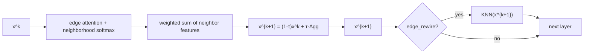

# DGAD — Discrete Graph Attention Diffusion

**DGAD** is a PyTorch library for **discrete graph attention diffusion**—a general graph neural network backbone that iteratively smooths node features on a graph. Neighbor weights are learned by attention; the topology may stay fixed or be rebuilt from features at each step.

`GND` / `GNDLayer` map node features to updated embeddings and can be plugged into any downstream pipeline: **node classification**, **supervised or unsupervised clustering**, **link prediction**, **semi-supervised learning**, or **self-supervised pre-training**. Graphs may be given as `edge_index` or built with feature-space KNN.

---

## Background

DGAD is motivated by the view of graph neural networks as **diffusion processes** on node features—neighboring nodes exchange information until representations stabilize. That perspective is developed formally for **continuous-time** graph diffusion in [Graph Neural Diffusion](https://arxiv.org/abs/2106.10934) (Chamberlain et al.), where dynamics follow a differential equation and depth corresponds to integration time.

DGAD takes the same smoothing intuition—**move each node toward an attention-weighted mixture of its neighbors**—but implements it as a **fixed number of explicit discrete steps** with a learnable step size \(\tau\). Attention defines who counts as a neighbor and with what weight; optional **dynamic rewiring** rebuilds edges from the current features between steps. The design keeps the feature dimension constant across all diffusion steps, following the dimension-preserving diffusion principle in the reference above.

---

## Algorithm

### Multi-step update

Given initial node features \(x^{(0)}\), DGAD applies \(K\) identical layers (`num_steps`). Each layer:

1. **Attention** — score each edge \((i \leftarrow j)\) in the neighborhood of target \(i\).
2. **Normalize** — softmax over incoming edges per target node.
3. **Aggregate** — sum weighted source features (multi-head mean).
4. **Propagate** — convex combination with the current state:

$$x^{(k+1)} = \tau \cdot \mathrm{Agg}_i(x^{(k)}) + (1-\tau)\cdot x^{(k)}$$

Here \(\tau\) is `time_increment` (default `0.2`). Feature dimension \(F\) is unchanged at every step.

Optional **encoder / decoder** linear maps map input and output dimensions while diffusion runs in a fixed \(F\)-dimensional space (`num_features`).

### Dynamic graph

When `edge_rewire=True`, the graph is reconstructed before each layer with KNN on the current \(x^{(k)}\) (`knn_graph` / `features_to_edge_index_knn_no_self_edge`). When `edge_rewire=False`, a fixed `edge_index` is reused for all steps.

### Building blocks and training

- **`GND`** — core \(K\)-step diffusion module. Forward pass returns node embeddings in diffusion space; attach your own head and loss (e.g. cross-entropy for labels, contrastive loss, clustering objectives).
- **`DGADModel`** — optional wrapper: diffusion plus an **inner-product adjacency decoder** for reconstruction-style training.
- **`fit_dgad`** — convenience trainer for `DGADModel` with feature MSE, adjacency BCE, or a weighted mix. Supervised tasks typically use `GND` (or `DGADModel` as a feature extractor) with a task-specific head and optimizer you define.

---

## Single-step flow



---

## Attention types

All types share the same pipeline after scoring: **neighborhood softmax → weighted aggregation → propagate**. Set `attention_type` to one of:

### `sum` — additive edge scores

$$e_{ij} = \mathrm{LeakyReLU}(a_s^\top h_j + a_t^\top h_i)$$

Learnable vectors \(a_s, a_t\) per head. Lightweight (\(\approx 2HF\) parameters); good default for smaller graphs.

### `prod` — bilinear edge scores

$$e_{ij} = \mathrm{LeakyReLU}(h_j^\top W_h h_i)$$

Learnable \(F \times F\) matrix \(W_h\) per head (target side projected). Richer interactions (\(\approx HF^2\) parameters).

### `dist` — distance-based edge scores

Scores from weighted squared differences along edges, with learnable per-dimension weights. Favors neighbors that are close in a learned feature metric.

Messages always use **source node features** (after attention weighting); there is no separate value projection.

---

## Package layout

```
DGAD/
├── dgad/
│   ├── diffusion/       # GND, GNDLayer
│   ├── attention/       # sum, prod, dist + neighborhood softmax
│   ├── graph/           # KNN and adjacency helpers
│   ├── models/          # DGADModel, encoders, inner-product decoder
│   └── training/        # fit_dgad
├── examples/
└── README.md
```

---

## Installation

```bash
cd DGAD
pip install -e .
```

Requires `torch>=2.0`.

---

## Usage

### Embeddings for any downstream task

```python
import torch
from dgad import GND, knn_graph

x = torch.randn(500, 64)
edge_index = knn_graph(x, k_min=0, k_max=15)

gnd = GND(num_features=32, num_steps=8, time_increment=0.2, attention_type="sum")
(_, _), embedding = gnd((x, edge_index))   # (N, 32) — use for clustering, kNN labels, a linear classifier, etc.
```

### Self-supervised reconstruction (optional)

```python
from dgad import DGADModel, fit_dgad

model = DGADModel(
    num_features=32,
    num_heads=8,
    num_steps=8,
    time_increment=0.2,
    encoder=[64, 32],
    decoder=[32, 64],
    edge_rewire=False,
)
out = fit_dgad(model, x, edge_index=edge_index, max_epochs=500, lr=1e-3)
embedding = out["embedding"]
```

### Supervised node classification (sketch)

```python
import torch.nn as nn
from torch.optim import Adam

gnd = GND(num_features=32, num_steps=8, time_increment=0.2)
head = nn.Linear(32, num_classes)

for epoch in range(epochs):
    (_, _), z = gnd((x, edge_index))
    loss = nn.functional.cross_entropy(head(z[train_mask]), y[train_mask])
    loss.backward()
    optimizer.step()
```

**Dynamic KNN each step:**

```python
model = DGADModel(..., edge_rewire=True)
fit_dgad(
    model, x,
    edge_rewire=True,
    edge_rewire_args={"k_min": 0, "k_max": 50, "remov_edge_prob": None},
)
```

See `examples/minimal_usage.py` for a runnable reconstruction example.

---

## API

| Symbol | Role |
|--------|------|
| `GND` | Core \(K\)-step GNN backbone; optional encoder/decoder; task-agnostic embeddings |
| `GNDLayer` | Single diffusion layer (compose or inspect one step) |
| `DGADModel` | `GND` + adjacency decoder for reconstruction-based training |
| `knn_graph` | Build `edge_index` from node features |
| `fit_dgad` | Optional trainer for `DGADModel` (MSE / BCE / mixed loss) |

**Hyperparameters**

| Parameter | Meaning | Default |
|-----------|---------|---------|
| `num_steps` | Diffusion depth \(K\) | `8` |
| `time_increment` | Step size \(\tau\) | `0.2` |
| `num_features` | Diffusion feature dim \(F\) | required |
| `num_heads` | Attention heads | `8` |
| `attention_type` | `sum` / `prod` / `dist` | `sum` |
| `edge_rewire` | Rebuild KNN every step | `False` |

---

## Citation

If you use DGAD in published work, please cite the Graph Neural Diffusion paper that motivates the diffusion view:

> Benjamin Chamberlain, James Rowbottom, Maria I. Gorinova, Michael Bronstein, Stefan Webb. *Graph Neural Diffusion.* ICML 2021. [arXiv:2106.10934](https://arxiv.org/abs/2106.10934)

Add a citation for your own method or application as appropriate.

---

## License

See `LICENSE` in this repository (to be added if not yet present).
